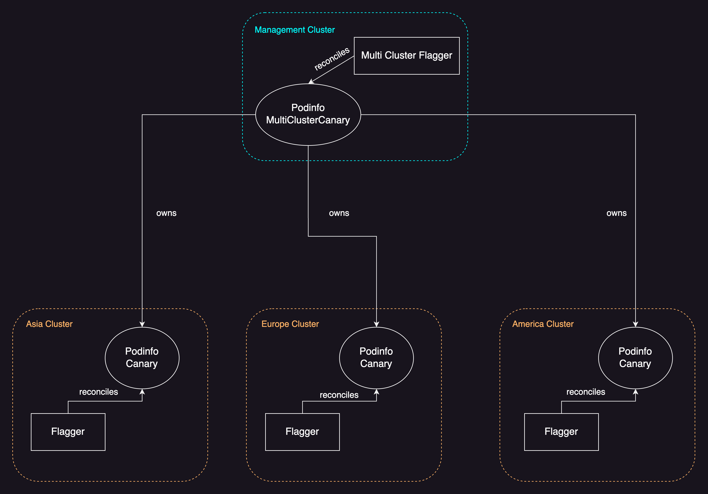
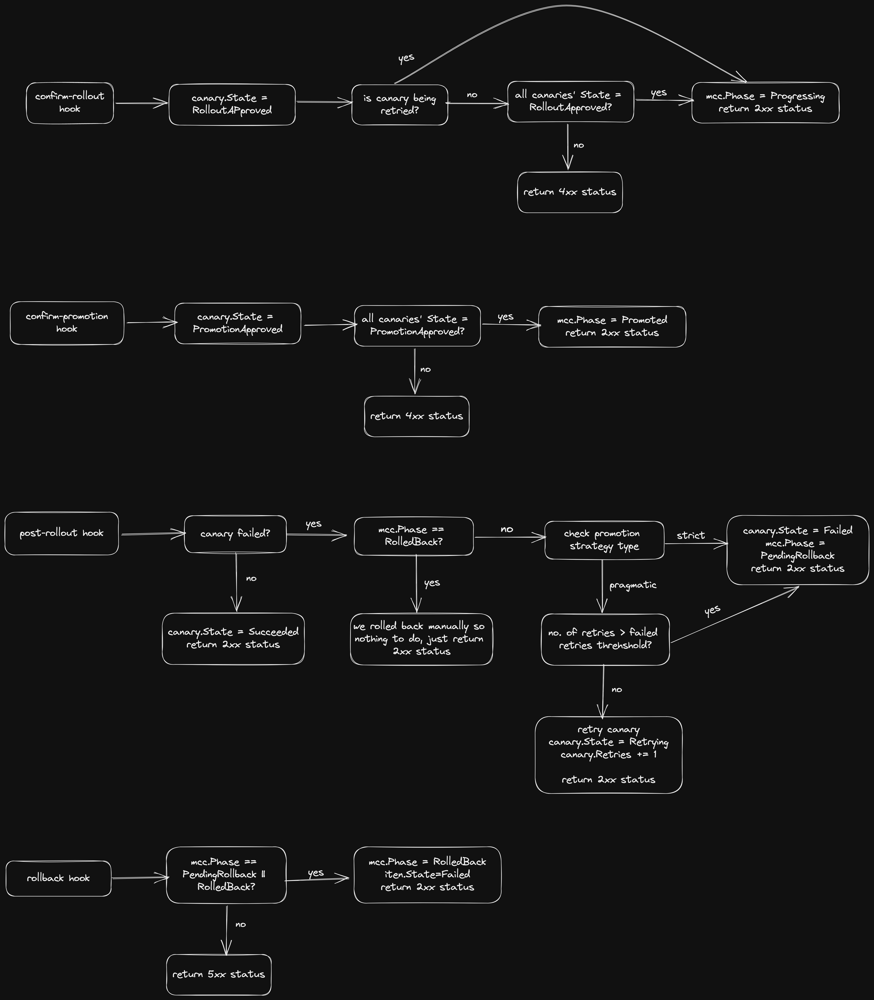

# Multi-Cluster Flagger

## Intro

Flagger is a Progressive Delivery tool that can perform Canary releases, A/B testing and Blue/Green deployments while integrating with a plethora of networking tools.
It has solid support for a lot of observability tools and offers a decent API for users to run various sorts of analyses.
But, it has one shortcoming and thats multi-cluster support. It can only manage workloads present in the cluster where it has been deployed.
Furthermore, the API it offers has 1:1 relationship with a Kubernetes Deployment, i.e. there needs to exist a Canary object for every single Deployment. This means its virtually impossible for users who want to adopt Progressive Delivery but have several workloads running across multiple clusters.

## Probelm scope

Lets say we have `x` no. of clusters and each cluster is running `y` no. of Deployments. This would require `x` * `y` no. of Canaries setup in such a way that analyses, promotion and rollbacks are coordinated and inter-dependent.
That means all Canaries should ideally start the analysis together and are promoted together.

The issue is determining how to promote/rollback a group of Canaries if a dependent Canary is failing. There are three strategies we can chose from in this scenario:

* Permissive: Ignore the failing Canaries and promote the ones that are ready for promotion.
* Strict: Even if a single Canary fails, rollback all the Canaries.
* Pragmatic: Retry the failing Canaries while the promotion of the others is paused. Promote or rollback all Canaries together depending on the result of the retries.

Let's consider a more exotic scenario. We have clusters running in different regions across the world such as, `eu-west-1`, `us-east-1`, etc. Some regions might be more mission critical than others so its more important for the workloads in those regions to have the latest patches than some others.
But depending on the promotion/rollback strategy we chose, a failing Canary in a non-mission critical region will end up blocking the promotion of the Canaries in the important regions.

Hence, there needs to be some sort of override switch offered for users to be able to unblock those Canaries. This can be tricky because then these Canaries will not be in sync with the ones that are failing and have not been promoted.

An additional problem which requires thought is how do we let Canaries start their analyses in a coordinated fashion? For example, lets say that due to some arbitary reason the Canaries in a few clusters did not get triggered to run a new analysis or there was a considerable delay for the same. How do we know when to actually start let the Canaries start progressing?

Here too, we have three options to choose from:

* Don't let any Canary progress until all the Canaries are ready.
* Wait for a certain amount of time for all Canaries to become ready after which they are let to start progress.
* Wait for a certain percentage of all Canaries to become ready after which they are let to start progress.

## Technical details

### API

We shall introduce a new CRD named `MultiClusterCanary`. Users will interact with this API and not with the `Canary` CRD. A `MultiClusterCanary` object contains the `Canary` specification for a specific workload deployed over multiple clusters.

Lets assume we have 5 clusters spread across the world:

```yaml
apiVersion: gitops.weave.works/v1alpha1
kind: GitopsCluster
metadata:
  name: cluster-01 | cluster-02 | cluster-03 | cluster-03 | cluster-05
  labels:
    weave.works/cluster-region: europe | asia | us 
spec:
  secretRef:
    name: <kubeconfig-secret-name>
```

Assuming that all 5 clusters have a Deployment and a HPA named `podinfo` installed, we can define the below `MultiClusterCanary` object to setup Progressive Delivery for them:

```yaml
apiVersion: fleet.flagger.app/v1alpha1
kind: MultiClusterCanary
metadata:
  name: podinfo
spec:
  # Label selector to match against all clusters this
  # object targets.
  gitopsClusterSelector:
    matchExpressions:
      -  { key: weave.works/cluster-region, operator: In, values: [asia, europe, us] }
  # Workload to perform Progressive Delivery for.
  targetRef:
    name: podinfo
    kind: Deployment
  # (optional) Autoscaler reference for the workload
  autoScalerRef:
    name: podinfo
    kind: HorizontalPodAutoscaler
    apiVersion: autoscaling/v2
  # Service configuration for the workload
  service:
    name: podinfo
    port: 9898
    portName: http
    # Overrides is a list of service config overrides
    # for specific clusters based on a label selector.
    overrides:
      - gitopsClusterSelector:
          matchLabels:
            weave.works/cluster-region: asia
        service:
          hosts:
           - asia.cluster
  # Analysis config for the Canary objects.
  analysis:
    interval: 30s
    threshold: 5
    maxWeight: 50
    stepWeight: 10
    metrics:
      - name: request-success-rate
        thresholdRange:
          min: 99
        interval: 1m
   webhooks:
     - name: "load-test"
       type: rollout
       url: http://flagger-loadtester.test/
         metadata:
           cmd: "hey -z 1m http://podinfo-canary.test:9898/"
    # Overrides is a list of analysis config overrides
    # for specific clusters based on a label selector.
    overrides:
      - gitopsClusterSelector:
          matchLabels:
            weave.works/cluster-region: asia
        analysis:
          threshold: 10
          metrics:
            - name: request-success-rate
              thresholdRange:
                min: 95
              interval: 1m
  # Timeout is the duration to wait for until all
  # Canaries report themselves to be in a state where
  # they are ready to start progress.
  timeout: 5m
  # Promotion/rollback strategy for this group of clusters.
  # Type can be one of: Permssive, Strict, Pragmatic
  promotionStrategy:
    type: Pragmatic
    # Threshold for failed retries before rolling back.
    # Used only when type is Pragmatic.
    failedRetriesThreshold: 10
```

#### Target clusters

`spec.gitopsClusters` is a label selector which matches against `GitopsCluster` objects. The clusters that these objects point to are considered to be the target clusters.

#### Target

`spec.targetRef` and `spec.autoSclareRef` (an optional field) are references to the workload and its autoscaler. The workload and the autoscaler are expected to be present in every target cluster.

#### Service

`spec.service` holds the Service and other networking configuration. This configuration is applied to all target clusters. To have some custom configuration applied to a cluster, use `spec.service.overrides`

#### Analysis

`spec.analysis` holds the analysis config. This config determines how each individual Canary will progress during a Canary analysis. To have custom analysis for a cluster, use `spec.analysis.overrides`.

#### Timeout

`spec.timeout` specifies the duration to wait for until all downstream Canary objects are in a state to start progress.
This is determined by checking if we have received the `confirm-rollout` webhook call for the Canary object.
The controller starts "waiting" as soon as the first webhook call is received, and if there are Canaries for which the webhook call is not received after the specified duration, those Canaries are ignored, and the rollout is started for the other Canaries.
If `nil`, then we wait forever.

#### Promotion strategy

`spec.promotionStrategy` is for describing how we want to handle promotion/rollback for the Canaries present in all the clusters after a canary run.
`spec.promotionStrategy.type` is an enum with the following variants:
* Permissive: This promotes all Canary object(s) that passed the canary analysis, even if other Canary object(s) are failing.
* Strict: If there is a failing Canary, then all Canaries regardless of their state are rolled back.
* Pragmatic: If there are some failing Canary object(s) and some Canary object(s) that passed the analysis, we pause the promotion of the latter and retry the former. If the retries lead to the previously failing Canary object(s) to start passing, then all Canaries are promoted together. If there are failing Canary object(s) after retrying for `spec.promotionStrategy.failedRetriesThreshold` times, then all Canaries are rolled back

### Software design

In the management cluster, users will install a new controller `multi-cluster-flagger`(MCF) offering its own [API](#api) which is a wrapper around Flagger's Canary API.
**Note:** All the target/leaf clusters should have Flagger installed.

The controller consists of a reconciler and a web server. The reconciler watches and reconciles `MultiClusterCanary` objects in the management cluster. The web server acts like a cooridnator, making sure that the Canaries' runs, promotions, retries, etc are in sync.

Let's say we apply the above `MultiClusterCanary` in the management cluster.
The reconciler will kick off and it will create the below `Canary` object and apply
it to all target clusters. Based on the `GitopsCluster` object that points to the
target cluster, some metadata is attached to the `Canary`'s webhooks.

```yaml
apiVersion: flagger.app/v1beta1
kind: Canary
metadata:
  name: podinfo
spec:
  targetRef:
    apiVersion: apps/v1
    kind: Deployment
    name: podinfo
  autoScalerRef:
    name: podinfo
    kind: HorizontalPodAutoscaler
    apiVersion: autoscaling/v2
  service:
    name: podinfo
    port: 9898
    portName: http
  analysis:
    interval: 30s
    threshold: 5
    maxWeight: 50
    stepWeight: 10
    metrics:
      - name: request-success-rate
        thresholdRange:
          min: 99
        interval: 1m
    webhooks:
     - name: "load-test"
       type: rollout
       url: http://flagger-loadtester.test/
         metadata:
           cmd: "hey -z 1m http://podinfo-canary.test:9898/"
     # these webhooks are auto generated by multi-cluster-flagger
    - metadata:
        clusterName: cluster-01 # name of GitopsCluster object
        clusterNamespace: default # namespace of GitopsCluster object
        mccNamespace: default # namespace of parent MultiClusterCanary object.
      muteAlert: false
      name: multi-cluster-flagger-confirm-rollout
      type: confirm-rollout
      url: http://multi-cluster-flagger.svc:8000/confirm-rollout
    - metadata:
        clusterName: cluster-01
        clusterNamespace: default
        mccNamespace: default
      muteAlert: false
      name: multi-cluster-flagger-confirm-promotion
      type: confirm-promotion
      url: http://multi-cluster-flagger.svc:8000/confirm-promotion
    - metadata:
        clusterName: cluster-01
        clusterNamespace: default
        mccNamespace: default
      muteAlert: false
      name: multi-cluster-flagger-post-rollout
      type: post-rollout
      url: http://multi-cluster-flagger.svc:8000/post-rollout
    - metadata:
        clusterName: cluster-01
        clusterNamespace: default
        mccNamespace: default
      muteAlert: false
      name: multi-cluster-flagger-rollback
      type: rollback
      url: http://multi-cluster-flagger.svc:8000/rollback

```



The auto generated webhooks are what enable the coordinated promotion/rollback of all the Canaries. Lets take a look at a step by step flow of how this would work with a `Pragmatic` promotion strategy:

* A MultiClusterCanary is applied in the management cluster. multi-cluster-flagger reconciles it and creates the required Canary in each target cluster.
* The CD pipeline changes the image tag for the target Deployment in all clusters, triggering a Canary run.
* Each Flagger instance will call the its `confirm-rollout` webhook before scaling up the canary deployment, letting MCF know that its about to start Canary run. MCF will respond with a non-2xx response for now.
* Once MCF has received a webhook call for each required Canary, it'll send a response with a 2xx status code, allowing the Flagger instances to start the Canary run.
* When a Canary passes the metric checks and is ready for promotion, the related Flagger instance will call the `confirm-promotion` webhook. MCF will respond with a non-2xx response for now.
* Eventually if every cluster's Canary passes the metric checks and MCF has received the webhook request for all of them, it will send a response with a 2xx status code, allowing the Canaries to be promoted.
* If there are Canary objects that failed, the related Flagger instance will call the `post-rollout` webhook, informing MCF about the failure.
* MCF will [retry](https://fluxcd.io/flagger/faq/#how-to-retry-a-failed-release) the failing Canaries. Meanwhile, it'll keep returning a non-2xx response to the Flagger instances reconciling the passing Canaries.
* If eventually the failing Canaries pass the metric checks and MCF receives the `confirm-promotion` webhook for them, it'll respond with a 2xx status code and let all the Canaries get promoted.
* If there are failing Canary object(s) even after retrying for `spec.promotionStrategy.failedThreshold` times, all the Canaries are rolled back.

If our promotion strategy was `Strict`, everything would be the same until there was a Canary that ended up failing. In that case, all the passing Canaries would be made to roll back by sending a 2xx response to the `rollback` webhook request.


